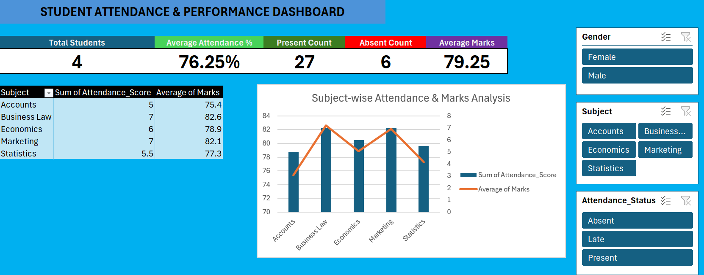

# 📊 Student Attendance & Performance Dashboard

## 📌 Project Overview

This project presents an interactive Student Attendance & Performance Dashboard created using Microsoft Excel.

The dashboard analyzes student attendance, academic performance, subject-wise trends, and attendance modes to provide a consolidated view of student performance.

## 🛠️ Tools & Techniques

- Microsoft Excel
- Excel Formulas
- XLOOKUP
- COUNTIF
- SUMIF
- AVERAGE
- Pivot Tables
- Data Analysis
- Data Visualization
- Interactive Dashboard

## 🎯 Project Objectives

- Track overall student attendance
- Analyze attendance by subject
- Compare student attendance performance
- Analyze academic marks
- Compare online and offline attendance
- Monitor attendance status
- Present key performance indicators through an interactive dashboard

## 📊 Dashboard Preview

## 🔍 Key Insights

- Overall attendance score: "76.25%"
- Total students: "4"
- Present records: "27"
- Absent records: "6"
- Average marks: "79.25"
- Ananya Jain recorded the highest attendance at "85%"
- Ananya Jain also recorded the highest average marks at "86"
- Business Law and Marketing recorded the highest attendance score at "87.5%"
- Accounts recorded the lowest attendance score at "62.5%"
- Offline attendance score was higher than online attendance

## 📁 Project Files

| File | Description |
|---|---|
| 'Attendance_Dashboard.xlsx' | Complete Excel workbook |
| 'screenshots/dashboard.png' | Dashboard preview |

## 💡 Key Takeaway

The analysis highlights differences in attendance across students and subjects. The dashboard can help identify subjects and students requiring closer attendance monitoring.

## 👨‍💻 Author

"Naman Gaur"

Aspiring Data Analyst

"Skills:" Excel | SQL | Power BI | Tableau
